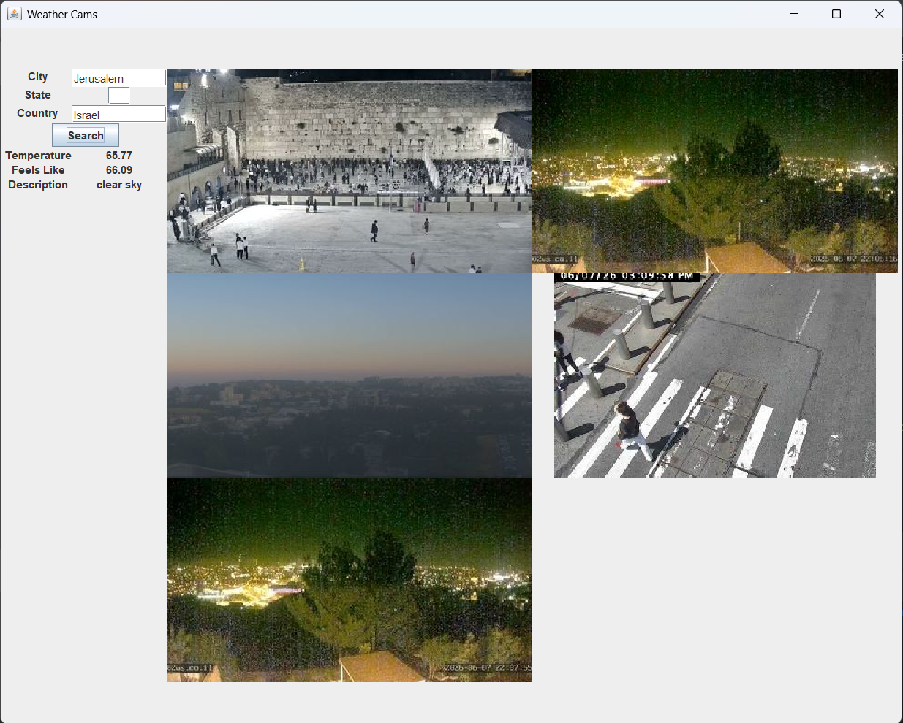

### Weather Data and Picture Generator

Program to display images and weather data of a location entered by user.
Using the OpenWeatherMap Geocoding API, the location is converted to coordinates.
Using the coordinates, current weather data is accessed using the OpenWeatherMap current weather data API, 
and images of the location are accessed using the Windy webcams API.
### Screenshots

#### Links

- [OpenWeatherMap](https://openweathermap.org/)
- [Windy](https://api.windy.com/)
- [ApiKey](https://github.com/andrewoid/apikeys)
- [RxJava](https://reactivex.io/)
- [Retrofit](https://square.github.io/retrofit/)
- [JUnit](https://junit.org/)
- [GridBagLayout](https://docs.oracle.com/javase/8/docs/api/java/awt/GridBagLayout.html)